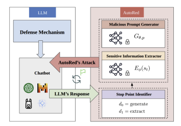








I'm a 1st year PhD student in Computer Science at Simon Fraser University, fortunate to be supervised by Dr. [Linyi Li](https://cs.sfu.ca/~linyi/) in the [Trustworthy AI (TAI) Lab](https://sfu-tai.github.io/). 

My primary research interest lies in the theoretical foundations of model structure, interpretability, learning algorithms, and reinforcement learning. At the same time, I care about socially responsible AI in practice, with applications in red teaming, safety, and AI governance.

# 🔥 News
- *2025.06*: &nbsp;🎉🎉 Participated in a hackathon with developers from my team at SAP about AI model governance.
- *2026.01*: Completed PhD coursework and breadth exam requirements.

# 📝 Publications 

  
  

    <strong><a href="https://ieeexplore.ieee.org/abstract/document/10825267" target="_blank">AutoRed: Automated Attack Scenario Generation Framework for Red Teaming of LLMs</a></strong> 
    <strong>Zhe Wang</strong>, M. A. Tayebi 
    <em>IEEE BigData 2024</em> 
    We present <strong>AutoRed</strong>, a red-teaming framework that proactively generates adversarial prompts to challenge LLMs’ refusal strategies and safety alignment.
  

<!-- # 🎖 Honors and Awards
- *2017.10* **First Prize**, Zhoushan division of the Zhejiang Provincial High School Mathematics Olympiad. -->

# 📖 Educations
- *2025.09 - 2029.08* (expected), Ph.D., Computer Science at Simon Fraser University
- *2022.09 - 2024.05*, M.Sc., Computer Science at Simon Fraser University
- *2018.09 - 2022.07*, B.Sc., Mathematics and Applied Mathematics at The Chinese University of Hong Kong, Shenzhen

# 💬 Invited Talks
- *2025.06*, _The Art of LLM Evaluation_, AI Lunch and Learn at SAP Canada, Vancouver office. 

# 💻 Internships
- *2024.09 - 2025.09*, Data Science Intern, SAP, Canada.
- *2023.07 - 2023.09*, Machine Learning Researcher Intern, Hanglok-Tech, China

# 🖋️Services
- Conference Reviewer: WWW
